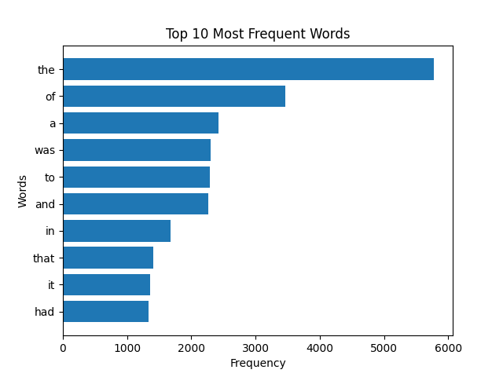

# Basics of parallel computing and the MapReduce model

## Task

Write a Python script that loads text from a given URL, analyzes the frequency of word usage in the text using the MapReduce paradigm, and visualizes the top words with the highest frequency of use in the text.

### Step-by-step instructions

1. Import the necessary modules (matplotlib and others).

2. Take the MapReduce implementation code from the outline.

3. Create a `visualize_top_words` function to visualize the results.

4. In the main code block, get the text from the URL, apply MapReduce, and visualize the results.

### Result
Top 10 Most Frequent Words for ["1984" by George Orwell from project Gutenberg](https://gutenberg.net.au/ebooks01/0100021.txt)


### Prerequisites 
```bash
poetry install
poetry shell
```

### How to run
```bash
poetry run .\app\main.py -w <word1> <word2> -u <url>
```
where 
- -w - search words. Optional
- -u - url of source. Optional. Default https://gutenberg.net.au/ebooks01/0100021.txt